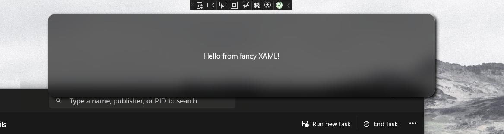
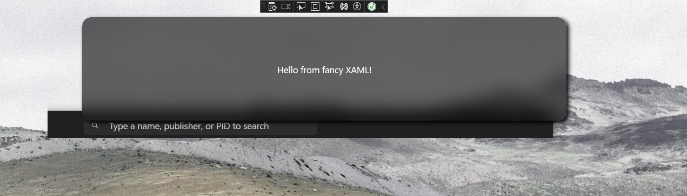

# WinUIWindowAnimatedTransparency

Test sample for showing a potential technique to animate anything over a stationary desktop in WinUI.

## Dependencies

Uses the following libraries:
 - [WinUIEx](https://github.com/dotMorten/WinUIEx)
 - [CsWin32](https://github.com/microsoft/CsWin32)
 - [Windows Community Toolkit](https://github.com/CommunityToolkit/Windows)

## Effect



While the window is initializing the XAML layer, the System Compositor is used to provide a fully transparent window via WinUIEx:

```cs
HwndExtensions.ToggleWindowStyle(hwnd, false, WindowStyle.TiledWindow);
```

And in XAML:

```xml
    <winex:WindowEx.SystemBackdrop>
        <winex:TransparentTintBackdrop />
    </winex:WindowEx.SystemBackdrop>
```

When XAML loads before the animation starts, the background of the window is replaced within it's root grid with an image of the captured desktop before the window was created (see App.xaml.cs).

This screen image is sliced to just the area behind the window.

In this fashion the regular in-app compositor effects of brushes provided within the Windows Community Toolkit can appear to work on the desktop, where normally they would not (as the tranparent pixels are not passed up).


We can complete the example with an implicit animation to easily make it appear as our content is flying in.

## Limitations

Works on static backdrops currently for more transient UI which is not expected to remain on screen.



The `SoftwareBitmapSource` would need to be continually updated for this effect to work with an animated background.

This example is not complete and just a POC. Shared here for illustrative and educational purposes.

## License

MIT
